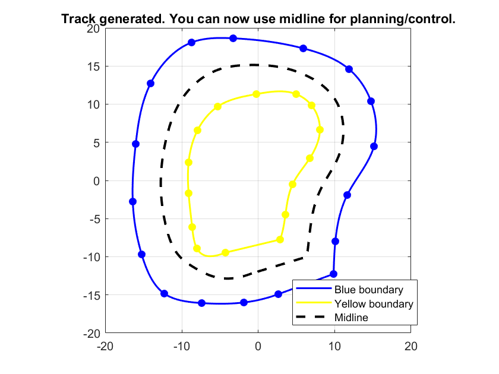

# Team FalconE Racing - Driverless Recruitment Assignment

This repository contains the submission for the Driverless Subsystem assignment for the 22 Batch Recruitment. The project implements an end-to-end perception and control pipeline for navigating a track marked by colored cones.

---
## Part 1: Cone Detection Model

This section details the development and training of a vision model to detect blue and yellow cones from an image feed, as required by the assignment.

### Model and Training Methodology

A **YOLOv8n (nano)** model was selected for this task due to its excellent balance of high speed and accuracy, making it suitable for real-time applications on a race car.

The model was trained for **40 epochs** using a Google Colab environment with a Tesla T4 GPU. The source code for the training process is available in the `cone_detection/` directory in the provided Colab Notebook.

### Dataset

The model was trained on the "cone Dataset" [1], which is available under the Creative Commons BY 4.0 license. This dataset was chosen as it contains a sufficient number of images with variations in lighting conditions and cone poses, which helps improve the model's robustness.

The dataset was downloaded and configured directly in the training script using the following Roboflow command:

```python
# NOTE: API key has been removed for security.
from roboflow import Roboflow
rf = Roboflow(api_key="xxxxxxxxxxxx")
project = rf.workspace("cone-xrbfs").project("cone-xy8w7")
version = project.version(1)
dataset = version.download("yolov8")
```
### Performance Results

The trained model demonstrates high performance and meets the requirements for a reliable cone detector.

* **Accuracy (mAP):** The model achieved a final **mAP50-95 of 0.862** and a **mAP50 of 0.991**, indicating a high level of accuracy in detecting the cone bounding boxes.
* **Runtime:** The model has an average inference speed of **2.0 ms per image** on a Tesla T4 GPU, confirming its suitability for real-time processing.

#### Training Results

The learning curves below show that the model's loss decreased steadily while the performance metrics (precision, recall, mAP) increased and stabilized, indicating a successful training process.


#### Class Separation

The confusion matrix below demonstrates a clear separation between the `blue` and `yellow` cone classes, with very few misclassifications. This confirms the model's ability to reliably distinguish between the two types of cones.


---
## Part 2: Perception, Geometry, Planning & Control

### 📌 Overview
This project demonstrates the pipeline for a simplified autonomous driving task:
1. **Perception** – Detecting cones (blue and yellow) to define track boundaries.
2. **Geometry** – Generating the midline between cones.
3. **Planning & Control** – Using a Pure Pursuit controller to follow the midline in simulation.

The work is implemented in **MATLAB**, with additional experiments using **YOLOv8 in Python**.


### 🧩 Task 1 – Perception
- A YOLOv8n model was trained in Colab on a Roboflow dataset of cones.
- The model successfully detected cones in test images (e.g., `1 b_cone, 4 y_cones`).
- Attempted to integrate the YOLOv8 model directly into MATLAB, but MATLAB did not support the model interface.  
  → Therefore, for the MATLAB simulation, cones were created manually.

### 🧩 Task 2 – Geometry
- Blue and yellow cones were placed manually in MATLAB to represent left and right track boundaries.
- A spline-based method was used to generate smooth boundaries.
- The **midline** was computed as the average between left and right boundaries.

**Midline Generation Example:**



---

### 🧩 Task 3 – Planning & Control
- Implemented a **Pure Pursuit controller** in MATLAB.
- Vehicle modeled with a simple bicycle kinematics update.
- The ego vehicle successfully followed the midline around the closed-loop track.

**Trajectory Following Example (GIF):**


---

### 🧩 Additional Attempts
- **YOLOv8 in MATLAB:** Tried to run the trained YOLOv8 model directly in MATLAB, but it was not supported.  
- **Driving Scenario Designer:** Explored creating roads and actors in the GUI, but did not implement the full pipeline further.  
- Final results are therefore based on **manual cone placement + midline generation + Pure Pursuit simulation**.

## 📂 Repository Structure
```
driverless_subsystem_assignment/
│
├── cone_detection/
│   ├── Cone_Detection_Training.ipynb
│   ├── training results/
|       |── best.pt
│
├── closed-path_navigation/
│   ├── manual_cone_track.m
│   ├── pure_pursuit_sim.m
│   └── manual_track.mat
│
└── README.md
```

### Reference
[1] cone-xrbfs, "Cone," *Roboflow Universe*, Oct. 2025. [Online]. Available: [https://universe.roboflow.com/cone-xrbfs/cone-xy8w7](https://universe.roboflow.com/cone-xrbfs/cone-xy8w7). [Accessed: Oct. 17, 2025].

[2] MathWorks, *Automated Driving Toolbox Documentation*, Natick, MA, USA: The MathWorks, Inc. [Online]. Available: [https://www.mathworks.com/help/driving/](https://www.mathworks.com/help/driving/)

[3] MathWorks, *Pure Pursuit Controller (Robotics System Toolbox)*, Natick, MA, USA: The MathWorks, Inc. [Online]. Available: [https://www.mathworks.com/help/robotics/ref/controllerpurepursuit-system-object.html](https://www.mathworks.com/help/robotics/ref/controllerpurepursuit-system-object.html)

[4] Ultralytics, *YOLOv8: Real-Time Object Detection*, 2023. [Online]. Available: [https://github.com/ultralytics/ultralytics](https://github.com/ultralytics/ultralytics)
